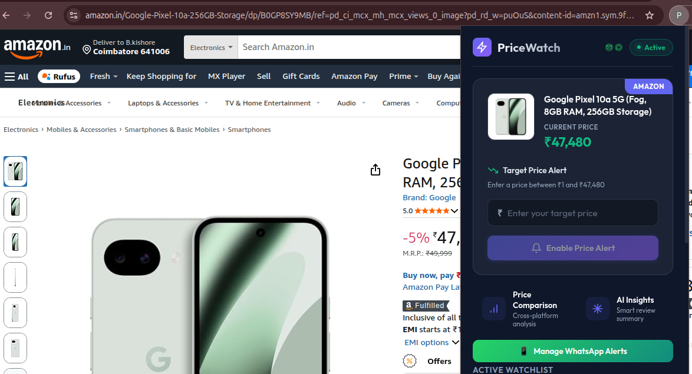
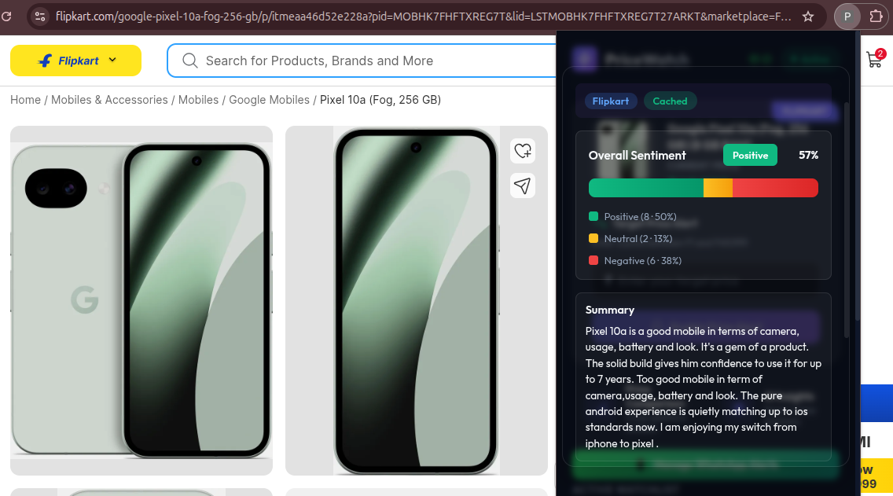
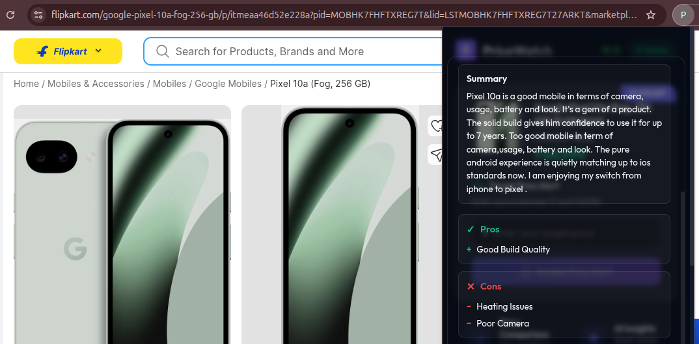
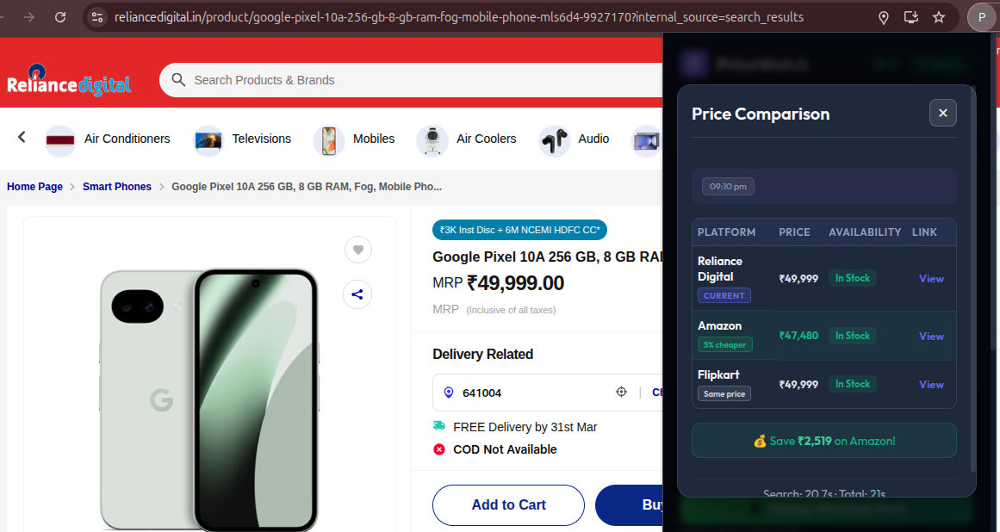

# PriceWatch 🛒

**PriceWatch** is a production-grade e-commerce intelligence platform that empowers users to make smarter purchasing decisions. It combines real-time price tracking, cross-platform product comparison, and AI-powered sentiment analysis into a seamless Chrome extension experience, monitoring prices across Amazon, Flipkart, and Reliance Digital with automated multi-channel notifications (email + WhatsApp).

---

## ✨ Core Features

### Price Intelligence
- **Smart Price Monitoring**: Track any product from supported e-commerce platforms with custom target price alerts
- **Intelligent Notifications**: Receive alerts via email or WhatsApp the moment your target price is reached
- **Dynamic Scheduling**: Adaptive price checks (45s for active tabs, 5 minutes in background, 2 minutes when near target)
- **Failure Resilience**: Automatic retry logic with exponential backoff; tracks failure history

### Cross-Platform Features  
- **Multi-Site Comparison**: Compare prices across Amazon, Flipkart, and Reliance Digital instantly
- **Fuzzy Product Matching**: TF-IDF similarity algorithm ensures accurate product matching across platforms
- **Real-Time Availability**: Check stock status across all platforms in one view

### AI-Powered Insights
- **Review Summarization**: BART-powered summaries (5-6 lines) synthesizing key review themes
- **Sentiment Analysis**: Dual-model analysis (DistilBERT + RoBERTa) with 0-100 sentiment score and multi-class distribution
- **Dynamic Pros/Cons Extraction**: KeyBERT semantic extraction pinpoints advantages and disadvantages from customer feedback
- **Multi-Language Support**: Processes English and transliterated text; filters spam automatically

### User Experience
- **Google OAuth Integration**: One-click login with automatic profile sync
- **WhatsApp Verification**: OTP-based secure WhatsApp number registration (5-min expiry, SHA256 hashed)
- **Multi-Channel Alerts**: Per-user notification preferences with repeat alert controls
- **Watchlist Management**: Add, edit, delete, and test alerts for tracked products

---

## 📸 Screenshots & Feature Showcase

### Price Tracking in Action

*Smart price monitoring on Amazon products with real-time alerts*

### Sentiment Analysis & Reviews

*AI-powered sentiment analysis with distribution metrics*

### Pros & Cons Extraction

*Dynamic extraction of product advantages and disadvantages from reviews*

### Cross-Platform Comparison

*Compare prices across multiple e-commerce platforms side-by-side*

---

## 🏗️ Architecture Overview

PriceWatch is built as a distributed system with three independent services:

### 1. **Chrome Extension** (`extension/`)
- **Tech Stack**: React 19 + Vite 7 + Vanilla CSS + Chrome MV3
- **Responsibilities**:
  - Context-aware product detection on supported e-commerce sites
  - On-page price & review extraction via content scripts
  - Real-time popup UI with watchlist management
  - Background service worker for interval-based price checks and notifications
- **Entrypoints**:
  - `popup.html` → React popup UI
  - `src/background/index.js` → Background service worker (Chrome MV3)
  - `src/content/index.js` → Content script (runs on product pages)

### 2. **Backend REST API** (`backend/`)
- **Tech Stack**: Node.js + Express 5.2.1 + MongoDB (Mongoose 9.1.5)
- **Responsibilities**:
  - User authentication & profile management (Google OAuth)
  - Persistent storage of price alerts (MongoDB)
  - Price checking orchestration via cron jobs (every 5 minutes)
  - Email notifications via Nodemailer
  - WhatsApp notifications via Baileys
  - Cross-platform product comparison & search
  - Review extraction and caching
  - Orchestration of Python NLP analysis
- **API Prefix**: All routes under `/api/`
- **Port**: 8000

### 3. **Python AI Service** (`ai-service/`)
- **Tech Stack**: FastAPI 0.115.6 + Uvicorn + HuggingFace Transformers
- **Responsibilities**:
  - Review preprocessing (HTML stripping, emoji conversion, deduplication, spam filtering)
  - BART-powered summarization of reviews
  - Dual-model sentiment analysis (DistilBERT + RoBERTa with confidence arbitration)
  - KeyBERT semantic keyphrase extraction
  - Fallback frequency-based pros/cons generation
- **Port**: 5001

---

## 📁 Detailed Project Structure

```
PriceWatch/
├── extension/                      # Chrome Extension (MV3)
│   ├── public/
│   │   └── manifest.json          # Extension permissions, OAuth config
│   ├── src/
│   │   ├── App.jsx                # Popup root component
│   │   ├── index.css              # Global popup styles
│   │   ├── main.jsx               # React entry point
│   │   ├── background/
│   │   │   ├── index.js           # Service worker, tab monitoring, alarms
│   │   │   └── notificationService.js  # Desktop notifications
│   │   ├── content/
│   │   │   ├── index.js           # Content script message handlers
│   │   │   ├── productScraper.js  # Platform-agnostic extraction
│   │   │   ├── reviewExtractor.js # Review pagination controller
│   │   │   ├── scrapers/          # Platform-specific scrapers
│   │   │   │   ├── amazonScraper.js
│   │   │   │   ├── flipkartScraper.js
│   │   │   │   └── relianceDigitalScraper.js
│   │   │   ├── selectors/         # CSS selectors per platform
│   │   │   │   ├── amazonSelectors.js
│   │   │   │   ├── flipkartSelectors.js
│   │   │   │   └── relianceSelectors.js
│   │   │   └── utils/             # Helpers (price parsing, availability)
│   │   └── popup/
│   │       ├── components/        # React components (15+ UI modules)
│   │       │   ├── Header.jsx, FeatureGrid.jsx, ProductCard.jsx
│   │       │   ├── PriceTracker.jsx, Watchlist.jsx
│   │       │   ├── ReviewSummaryTable.jsx, SentimentChart.jsx
│   │       │   ├── PriceComparisonTable.jsx
│   │       │   ├── WhatsAppSettings.jsx, ErrorState.jsx
│   │       │   └── LoadingState.jsx, Footer.jsx
│   │       └── hooks/             # Custom React hooks
│   ├── vite.config.js             # Build: React popup + content + bg scripts
│   ├── eslint.config.js
│   └── package.json
│
├── backend/                        # Express REST API
│   ├── server.js                  # Express app setup, middleware, scheduler
│   ├── package.json               # Dependencies (Express, Mongoose, etc.)
│   ├── config/
│   │   ├── constants.js           # Price check interval, timeouts, thresholds
│   │   ├── database.js            # MongoDB connection via Mongoose
│   │   ├── email.js               # Nodemailer SMTP config
│   │   └── (others)
│   ├── routes/
│   │   ├── index.js               # Route aggregator (/api/auth, /api/tracker, etc.)
│   │   ├── authRoutes.js          # OAuth, OTP, WhatsApp verification
│   │   ├── trackingRoutes.js      # Price alert CRUD + manual checks
│   │   ├── reviewRoutes.js        # Review analysis orchestration
│   │   ├── comparisonRoutes.js    # Multi-site product comparison
│   │   └── whatsappRoutes.js      # WhatsApp QR, connection, messaging
│   ├── controllers/
│   │   ├── authController.js      # HTTP handlers for auth routes
│   │   └── trackingController.js  # HTTP handlers for tracking routes
│   ├── models/
│   │   ├── User.js                # User schema (OAuth, WhatsApp, OTP fields)
│   │   ├── Tracking.js            # Price alert schema with indexes
│   │   └── userModel.js           # (legacy/alternate)
│   ├── services/
│   │   ├── authService.js         # Google token validation, user upsert
│   │   ├── otpService.js          # OTP generation, verification, cooldown
│   │   ├── trackingService.js     # Price check execution, notifications
│   │   ├── priceComparisonService.js  # Multi-site search + TF-IDF matching
│   │   ├── reviewOrchestrator.js  # Pipeline coordinator (validation → AI → cache)
│   │   ├── reviewExtractionService.js  # Smart review filtering
│   │   ├── reviewScrapingService.js    # Server-side pagination (Amazon/Flipkart)
│   │   ├── pythonNlpClient.js     # HTTP bridge to Python service (circuit breaker)
│   │   ├── emailService.js        # Alert formatting + Nodemailer send
│   │   ├── whatsappService.js     # Baileys connection, message queue
│   │   ├── notificationService.js # Unified email + WhatsApp notifier
│   │   ├── scrapingService.js     # Generic HTML scraping with retry
│   │   ├── productMatcher.js      # (helper functions)
│   │   └── scrapers/
│   │       ├── amazonSearchScraper.js   # Search + product extraction
│   │       ├── flipkartSearchScraper.js # Search + product extraction
│   │       └── relianceSearchScraper.js # Search + product extraction
│   ├── middlewares/
│   │   └── errorHandler.js        # Centralized error handling
│   ├── jobs/
│   │   ├── priceMonitor.js        # Cron job logic (every 5 minutes)
│   │   └── scheduler.js           # node-cron scheduler orchestration
│   ├── utils/
│   │   ├── browserPool.js         # Puppeteer connection pooling
│   │   ├── cacheService.js        # In-memory cache (analysis results)
│   │   ├── priceExtractor.js      # Price parsing utilities
│   │   ├── responseHelper.js      # Standard response formatting
│   │   ├── sanitizer.js           # Input validation/sanitization
│   │   ├── textCleaner.js         # Text preprocessing
│   │   └── timeoutGuard.js        # Timeout enforcement helpers
│   ├── validators/
│   │   └── trackingValidator.js   # Schema validation for tracking requests
│   ├── debug-scrapers.js          # Development scraper test utility
│   ├── migrate-db.js              # Database migration script
│   ├── unit-tests.js              # Test suite
│   └── test-*.js                  # Individual service tests (email, whatsapp, smtp)
│
├── ai-service/                     # Python FastAPI NLP Service
│   ├── app.py                     # FastAPI app, /health, /analyze endpoints
│   ├── preprocessing.py           # Review cleaning, deduplication, spam filter
│   ├── keyphrase.py               # KeyBERT extraction + fallback frequency
│   ├── sentiment-analysis.py      # (Reference script for validation)
│   ├── review-summary.py          # (Reference script for validation)
│   ├── requirements.txt           # Dependencies
│   └── __pycache__/               # Compiled Python modules
│
├── package.json                   # Root package config
├── README.md                      # This comprehensive guide
└── PROJECT_REPORT_DOCUMENTATION.txt  # Technical specifications document
```

---

## 🚀 Complete Installation & Setup

### Prerequisites
- **Node.js** 18+ with npm
- **Python** 3.9+ with pip
- **MongoDB Atlas** account (free tier available)
- **Google OAuth** credentials (for Chrome extension)
- **SMTP email** provider (Gmail, SendGrid, etc.)
- **Chrome/Chromium** browser

### 1. Backend Setup

```bash
cd backend
npm install
```

**Configure `.env` file in `backend/` directory:**
```env
# Database
MONGODB_URI=mongodb+srv://<user>:<password>@<cluster>/<database>

# Email Notifications (Nodemailer)
EMAIL_USER=your-email@gmail.com
EMAIL_PASS=your-app-specific-password

# Python AI Service
PYTHON_SERVICE_URL=http://localhost:5001
PYTHON_TIMEOUT_MS=300000

# WhatsApp (optional, set to false to disable)
WHATSAPP_ENABLED=true

# Server Port (default 8000)
PORT=8000
```

**Start the backend:**
```bash
npm start
# Server runs on http://localhost:8000
# Automatic price checks start immediately (cron: every 5 minutes)
```

**What happens:**
- Connects to MongoDB
- Initializes the scheduler
- Sets up route handlers
- Main service runs on port 8000
- Price monitor job starts (non-blocking)

### 2. AI Service Setup

```bash
cd ai-service
pip install -r requirements.txt
```

**Launch the service:**
```bash
python -m uvicorn app:app --host 0.0.0.0 --port 5001
# Service runs on http://localhost:5001
# Models auto-load on startup (~30-60 seconds)
```

**What happens:**
- DistilBERT, RoBERTa, BART, All-MiniLM-L6-v2 models download on first run (~3-5 GB)
- Service becomes ready after all models load
- Exposes `/health` and `/analyze` endpoints

### 3. Extension Setup

```bash
cd extension
npm install
npm run build
# Output: extension/dist/ (ready to load)
```

**Load into Chrome:**
1. Open `chrome://extensions/`
2. Enable **Developer mode** (toggle top-right)
3. Click **"Load unpacked"**
4. Select the `extension/dist/` folder  
5. Extension appears in your toolbar

**Start building locally (recommended for development):**
```bash
npm run watch
# Vite watches src/ for changes
# Auto-rebuilds dist/ on every save (~2 seconds)
# Refresh extension in Chrome after each rebuild
```

---

## 📡 API Endpoints Reference

All endpoints require valid Google OAuth tokens in the `Authorization: Bearer <token>` header.

### **Authentication Routes** (`/api/auth`)

```
POST   /api/auth/google
       Body: { token: "google_id_token" }
       Response: { success, user: { email, name, picture }, token }

POST   /api/auth/whatsapp/send-otp
       Body: { email, phoneNumber }
       Response: { success, expirySeconds: 300 }

POST   /api/auth/whatsapp/verify-otp
       Body: { email, otp }
       Response: { success, verified: true }

POST   /api/auth/whatsapp/toggle
       Body: { email, enabled: true }
       Response: { success, whatsappNotificationsEnabled }

GET    /api/auth/whatsapp/status/:email
       Response: { verified: true, number, notificationsEnabled }
```

### **Tracking Routes** (`/api/tracker`)

```
POST   /api/tracker/add
       Body: { email, productName, currentPrice, targetPrice, url, 
               platform, image, currency }
       Response: { success, trackingId, message }

GET    /api/tracker/list/:email
       Response: { success, alerts: [...], count: 5 }

GET    /api/tracker/check/:email/:url
       Response: { success, isTracked: true, tracking: {...} }

DELETE /api/tracker/delete/:id
       Response: { success, deletedId }

DELETE /api/tracker/remove/:email/:url
       Response: { success }

POST   /api/tracker/check-now/:id
       Response: { success, checkResult: {...} }

POST   /api/tracker/test-email/:id
       Response: { success, emailSent: true }

POST   /api/tracker/test-whatsapp/:id
       Response: { success, messageSent: true }
```

### **Review Analysis Routes** (`/api/reviews`)

```
POST   /api/reviews/analyze-direct
       Body: { reviews: [{text, rating, author?, title?}], 
               platform, productId }
       Response: { success, summary, sentimentScore, 
                   sentimentDistribution, pros, cons,
                   processingMs }

POST   /api/reviews/invalidate-cache
       Body: { platform, productId }
       Response: { success, cacheCleared }

GET    /api/reviews/health
       Response: { nodeStatus, pythonStatus, circuitBreakerState }
```

### **Comparison Routes** (`/api/comparison`)

```
POST   /api/comparison/compare
       Body: { productName, referencePrice? }
       Response: { success, results: [{platform, name, price, url, 
                   availability}], bestPrice }
```

### **WhatsApp Routes** (`/api/whatsapp`)

```
GET    /api/whatsapp/status
       Response: { connected: true, authenticated: false }

POST   /api/whatsapp/initialize
       Response: { success, qrCode: "..." }

GET    /api/whatsapp/qr
       Response: { qrCode: "data:image/png;base64,..." }

POST   /api/whatsapp/disconnect
       Response: { success, disconnected: true }

POST   /api/whatsapp/clear-session
       Response: { success }

POST   /api/whatsapp/test-message
       Body: { number, message }
       Response: { success, messageSent }
```

---

## 🗄️ Database Schema

### **User Collection**
```javascript
{
  _id: ObjectId,
  email: String,                      // Unique, from Google OAuth
  googleId: String,
  name: String,
  picture: String,
  whatsappNumber: String,             // E.164 format: +919876543210
  whatsappVerified: Boolean,
  whatsappNotificationsEnabled: Boolean,
  whatsappOtp: String,                // SHA256 hash
  whatsappOtpExpiry: Date,            // 5-minute window
  whatsappOtpAttempts: Number,        // Max 5
  whatsappPendingNumber: String,      // Staged during re-verification
  createdAt: Date,
  updatedAt: Date
}
```

### **Tracking Collection**
```javascript
{
  _id: ObjectId,
  userEmail: String,                  // Indexed
  productName: String,
  currentPrice: Number,
  previousPrice: Number,
  targetPrice: Number,
  url: String,
  platform: String,                   // "amazon" | "flipkart" | "reliance_digital"
  image: String,                      // Product image URL
  currency: String,                   // "INR", "USD", etc.
  isActive: Boolean,
  lastChecked: Date,
  notified: Boolean,
  notifiedAt: Date,
  lastNotificationChannels: {
    email: Date,
    whatsapp: Date
  },
  repeatAlerts: Boolean,              // Send alert multiple times
  failureCount: Number,
  lastError: String,
  createdAt: Date,
  updatedAt: Date,
  
  // Indexes:
  // { userEmail, url } - Unique compound
  // { userEmail }
}
```

---

## 🛠️ Development Workflow

### Recommended Development Setup

**Terminal 1 - Backend:**
```bash
cd backend
npm start
# Logs start with [Backend], [Cron], [Scheduler] tags
```

**Terminal 2 - AI Service:**
```bash
cd ai-service
python -m uvicorn app:app --reload --host 0.0.0.0 --port 5001
# Auto-reloads on file changes
```

**Terminal 3 - Extension (Watch Mode):**
```bash
cd extension
npm run watch
# Auto-rebuilds on src/ changes
# Refresh extension in chrome://extensions/ after rebuild
```

### File Editing Impact

| Location | Change Required | Test Steps |
|---|---|---|
| `backend/services/*.js` | Restart backend | Restart terminal 1, test API |
| `backend/jobs/priceMonitor.js` | Restart backend | Trigger `/api/tracker/check-now/:id` |
| `ai-service/*.py` | Auto-reload | Wait for uvicorn reload message |
| `extension/src/popup/**/*.jsx` | Rebuild + refresh | `npm run watch` auto-rebuilds, refresh popup in Chrome |
| `extension/src/content//*.js` | Rebuild + page refresh | `npm run watch` auto-rebuilds, refresh e-commerce page |
| `extension/src/background/index.js` | Rebuild + reload | `npm run watch` auto-rebuilds, reload extension in `chrome://extensions/` |
| CSS (`*.css`) | Rebuild + refresh | Auto-rebuilds, refresh UI |

### Chrome DevTools Debugging

**Popup UI:**
- Right-click popup → "Inspect" → DevTools for React debugging

**Background Service Worker:**
- `chrome://extensions/` → PriceWatch → "Background page" link

**Content Script:**
- Right-click product page → "Inspect" → "Console" tab (shows content script logs)

**API Requests:**
- Popup DevTools → "Network" tab → filter for API calls to `localhost:8000`

---

## 📊 Configuration & Tuning

### Price Monitor Intervals (`backend/config/constants.js`)

```javascript
PRICE_CHECK_INTERVAL: '*/5 * * * *'           // Cron: Every 5 min
SCRAPE_TIMEOUT: 10000                         // 10 seconds per request
NEAR_TARGET_THRESHOLD: 0.10                   // 10% above target
INTERVAL_ACTIVE_TAB: 45/60                    // 45 sec (active tab)
INTERVAL_BACKGROUND: 5                        // 5 min (background)
INTERVAL_NEAR_TARGET: 2                       // 2 min (price near target)
WHATSAPP_OTP_EXPIRY_MS: 5*60*1000             // 5 minutes
WHATSAPP_MESSAGE_RATE_LIMIT_MS: 2000          // 2 sec between messages
```

### AI Service Parameters (`ai-service/app.py`)

```python
MAX_REVIEWS = 2000                            # Input limit
MAX_REVIEW_CHARS = 5000                       # Per-review limit
ROBERTA_CONFIDENCE_THRESHOLD = 0.65           # Use RoBERTa if uncertain
SENTIMENT_BATCH_SIZE = 32                     # CPU batch size
BART_MAX_TOTAL_CHARS = 24_000                 # Summary input limit
REQUEST_TIMEOUT_SECS = 300                    # 5 minute timeout
```

---

## ✅ Supported E-Commerce Platforms

### **Amazon**
- Domains: .com, .in, .co.uk, .de, .ca
- Features: ✅ Product extraction, ✅ Price scraping, ✅ Review pagination, ✅ Availability check, ✅ Cross-site search

### **Flipkart**
- Domains: .com, .in
- Features: ✅ Product extraction, ✅ Price scraping, ✅ Review pagination, ✅ Availability check, ✅ Cross-site search

### **Reliance Digital**
- Domains: .in
- Features: ✅ Product extraction, ✅ Price scraping, ✅ Review extraction, ✅ Cross-site search

---

## 🔐 Security Notes

- **OTP Storage**: SHA256 hashed with 5-minute expiry
- **OAuth**: Token introspected with Google userinfo endpoint
- **Database**: MongoDB Atlas with connection string from environment
- **Secrets**: All credentials in `.env` (never committed to git)
- **WhatsApp Rate Limiting**: 2-second gap between messages to prevent bans

---

## 📚 Tech Stack Summary

| Layer | Technology | Version |
|---|---|---|
| Extension | React + Vite | 19 + 7 |
| Extension Build | Chrome MV3 | Latest |
| Backend | Express.js | 5.2.1 |
| Database | MongoDB + Mongoose | Latest + 9.1.5 |
| Python AI | FastAPI + Uvicorn | 0.115.6 + 0.32.1 |
| NLP Models | HuggingFace Transformers | 4.47.1 |
| Notifications | Nodemailer + Baileys | 7.0.13 + 7.0.0-rc.9 |
| Scheduling | node-cron | 4.2.1 |
| HTTP Client | Axios | 1.13.4 |
| DOM Parsing | Cheerio | 1.2.0 |
| Scraping | Puppeteer | 24.37.5 |

---

## 🐛 Troubleshooting

### "Extension not loading"
- Clear browser cache: `chrome://settings/clearBrowserData`
- Rebuild extension: `npm run build`
- Re-load unpacked in chrome://extensions/

### "Python service health check failing"
- Verify AI service is running on port 5001
- Check firewall: `curl http://localhost:5001/health`
- Check dependencies: `pip list | grep -E "torch|transformers"`

### "Price checks not running"
- Verify MongoDB connection: Check backend logs for connection errors
- Check cron job: Manually trigger `/api/tracker/check-now/:id`
- Verify WhatsApp/Email config: Test endpoints `/api/tracker/test-email/:id`

### "Reviews not analyzing"
- Check circuit breaker state: `/api/reviews/health`
- Verify Python service is accessible: `curl http://localhost:5001/health`
- Check review payload size: Max 2000 reviews per request

